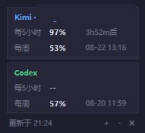

# AI Quota Widget（额度监控悬浮窗）

一个 Windows 桌面悬浮小工具，定时显示 **Kimi Code**、**Codex**（可选 **GLM**）的用量额度：



## 30 秒安装（让 AI agent 帮你装）

不想自己动手？把这句话发给你的 AI agent（Kimi Code / Codex / Claude Code 等均可）：

> 帮我安装 ai-quota-widget：https://github.com/IanCJ86/ai-quota-widget ，读仓库里的 AGENTS.md 按步骤执行。

agent 会完成全部工作，你只需要口述续订日期和套餐名。它实际执行的命令是：

```bash
git clone https://github.com/IanCJ86/ai-quota-widget.git
cd ai-quota-widget
powershell -ExecutionPolicy Bypass -File install.ps1
```

也可以完全手动：下载仓库 → 跑 `install.ps1` → 编辑桌面 `quota-widget\config.json` → 双击 `start.bat`。

## 功能

- 显示 Kimi Code / Codex 的 **每 5 小时** 与 **每周** 额度剩余百分比
- **Codex 重置雷达**：Codex 卡片内一行「雷达」，显示未来 24 小时全局重置概率（数据源 [codex-reset.com](https://codex-reset.com) 的 forecast 接口；置信度低/中时标注 ·低 / ·中，拉取失败静默降级为 `雷达 --`）
- **可选 GLM Coding Plan 卡片**：在 config.json 填入 `glm_api_key` 后自动出现，显示 5 小时 / 每周额度与重置时间（需有效的 GLM Coding Plan Key，见「配置项」）
- 显示额度重置时间（5 小时窗显示倒计时，每周窗显示具体时间）
- 显示套餐名与续订日期（接口不返回，在 `config.json` 里配置）
- 每 15 分钟自动刷新，刷新时刻对齐整刻（:00 / :15 / :30 / :45）
- 双击窗口立即刷新；右键菜单：置顶 / 立即刷新 / 白天黑夜切换 / 退出
- 右键可分别勾选显示 Kimi / Codex / GLM 卡片，选择写回 `config.json`，重启后自动沿用
- **黑夜 / 白天双主题**
- 底部 ＋ / － 按钮微调窗口透明度（3% 步进），✕ 关闭
- 无边框、可拖动、可置顶、圆角（Win11 原生抗锯齿）
- 高 DPI 屏幕原生渲染，字体清晰不毛边；窗口尺寸自动贴合内容
- 纯 tkinter 绘制，仅 Python 标准库

## 使用方法

1. 安装 Python 3（仅用到标准库，无需 pip 安装任何依赖）
2. 本机需已登录 Kimi Code CLI（凭证位于 `~/.kimi-code`）和 Codex CLI（`~/.codex`，需可调用 `codex app-server`）
3. 下载本仓库，双击 `start.bat` 即可启动（通常无控制台窗口；如果系统没有 pythonw.exe，可能会出现控制台窗口）

也可以直接运行：

```
python quota_monitor.py
```

## 刷新逻辑

- 启动时立即刷新一次，之后每 15 分钟自动刷新，且刷新时刻对齐时钟整刻（:00/:15/:30/:45），避免各自为政的漂移
- 双击窗口任意位置立即刷新
- Kimi 数据来自官方接口 `api.kimi.com/coding/v1/usages`；access_token 过期时会用本地 refresh_token 自动续期（client_id 为 CLI 公开值）
- Codex 数据通过本机 `codex app-server`（stdio JSON-RPC）读取 `account/rateLimits/read`
- 雷达数据来自 `codex-reset.com/api/forecast`（第三方公开预测接口，不含任何个人凭证）
- GLM 数据来自 `open.bigmodel.cn/api/monitor/usage/quota/limit`（国际版 `api.z.ai` 同路径），用 config.json 里的 apiKey 鉴权
- 所有 CLI 凭证只从本机 `~/.kimi-code` 与 `~/.codex` 读取，代码不打印、不上传任何 token

## 配置项

所有个性化配置都在 **`config.json`**（与 `quota_monitor.py` 同目录），不用改代码。不存在时用占位默认值。右键菜单的显示开关也会写回这个文件：

| 字段 | 说明 | 示例 |
| --- | --- | --- |
| `renew_kimi` | Kimi 续订日期，仅用于显示，格式 `MM-DD` | `"09-01"` |
| `renew_codex` | Codex 续订日期，仅用于显示 | `"09-15"` |
| `kimi_plan_name` | Kimi 套餐显示名（接口只返回等级，这里覆盖显示） | `"Allegro"` |
| `codex_plan_suffix` | Codex 套餐名后缀，追加在接口返回值后 | `" 20x"` |
| `show_kimi` / `show_codex` / `show_glm` | 各卡片是否显示 | `true` / `false` |
| `glm_api_key` | 可选，GLM Coding Plan API Key；填了 GLM 卡片才可能出现 | `"sk-..."` |
| `glm_region` | `"cn"` → open.bigmodel.cn，`"intl"` → api.z.ai | `"cn"` |

注意：`renew_*`、`kimi_plan_name`、`codex_plan_suffix`、`glm_*` 的修改需要重启 widget 生效；`show_*` 用右键菜单切换即时生效。

### 关于 GLM 卡片

GLM 额度接口（`monitor/usage/quota/limit`）是智谱官方 Claude Code 插件使用的内部接口，需要**有效的 GLM Coding Plan Key** 才能调通；套餐过期或 Key 无效时该卡片刷新失败（状态行会提示 `glm`）。接口返回每 5 小时与每周两条 `TOKENS_LIMIT` 记录，widget 按 `reset_time` 升序取前两条展示，另有一条每月 MCP `TIME_LIMIT` 目前不显示。

## FAQ

**能像 npm 一样 `npm install` 就装好吗？**
不能也不必。本工具是纯 Python 标准库应用（界面用 tkinter，必须跑在系统 Python 上，npm 管不到它）。`install.ps1` 一键脚本提供同等体验：检查环境 → 复制文件 → 生成启动器 → 可选开机自启，全程约 30 秒。配合 AGENTS.md，你的 AI agent 可以全程代办。

**需要提供 token 吗？**
不需要。Kimi / Codex 凭证来自本机已登录的 CLI；GLM 是唯一的例外，需要你自己在 config.json 里填 API Key。

**雷达是什么？**
对「Codex 额度什么时候全局重置」的第三方概率预测，仅供参考，不代表官方信息。

## 支持范围与局限

- 支持 Kimi Code、Codex，可选 GLM Coding Plan；暂无 Claude / DeepSeek 等方案
- 仅支持 Windows（依赖本机 CLI 凭证与 tkinter）
- 套餐名与续订日期无法从接口自动读取，需要手动配置（见上文「配置项」）

欢迎 issue / PR 扩展更多服务商。

## 隐私与安全说明

- 本仓库不包含任何本地凭证或账号信息
- 程序运行时会读取本机凭证（`~/.kimi-code`、`~/.codex`），不会上传、打印或外传
- Kimi 侧仅访问官方域名 `api.kimi.com` 与 `auth.kimi.com`
- Codex 侧通过本机 `codex app-server` 获取额度，不直接访问网络
- 雷达与 GLM 请求分别发往 `codex-reset.com` 与智谱官方域名；GLM Key 只存在你自己的 config.json 里
- Kimi 凭证过期时，程序可能用 refresh_token 自动续期并**更新本地凭证文件**
- 这是个人自用工具：不建议直接运行未经检查的第三方修改版，改完自己看一遍代码再用

## 免责声明

本项目为个人学习/自用工具，与 Moonshot AI、OpenAI、智谱无任何隶属或官方关系。接口与凭证读取方式依赖第三方客户端的本地行为，可能随其版本更新而失效。雷达数据为第三方预测，仅供参考。请遵守相关服务条款，使用风险自负。

## License

MIT © IanCJ86
