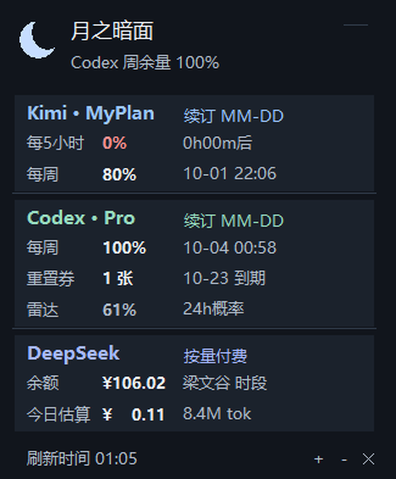
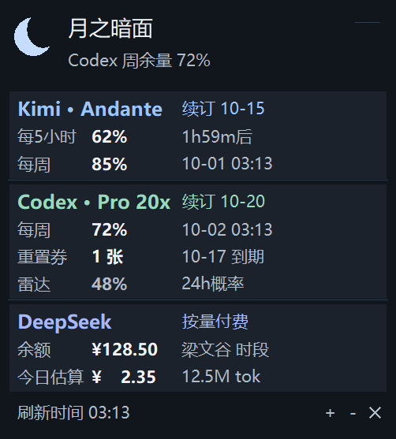
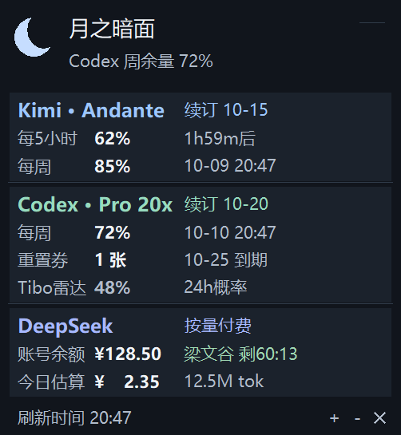
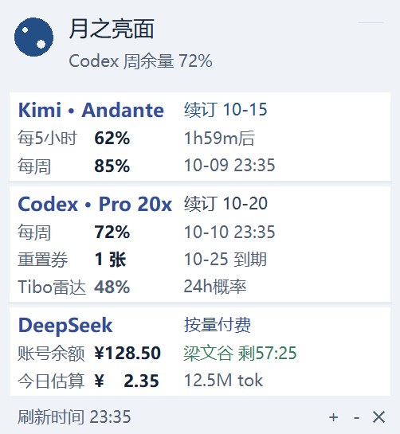
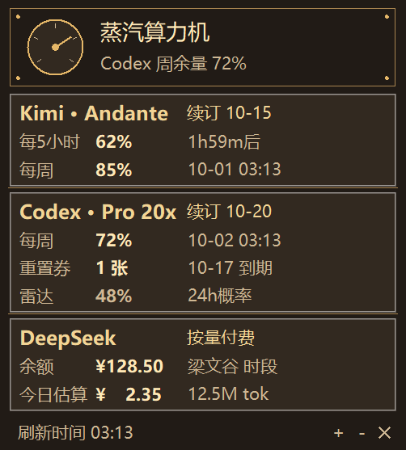
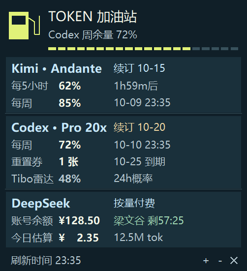
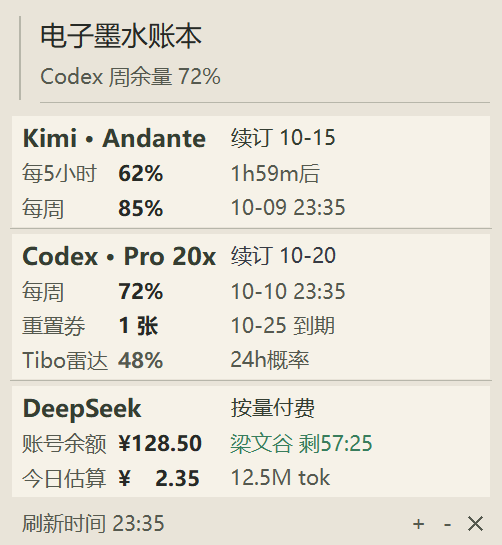

# AI Quota Widget（额度监控悬浮窗）

一个 Windows 桌面悬浮小工具，定时显示 **Kimi Code**、**Codex**、可选 **GLM** 的用量额度，以及 **DeepSeek** 余额和本机 token 统计：



上图为毛玻璃主题。以下五套其他主题可右键切换（月之暗面 / 月之亮面 / 蒸汽算力机 / Token 加油站 / 电子墨水账本）：



图片由真实界面在隔离测试桌面渲染，使用合成演示数据，不是个人账户或实时读数。毛玻璃透色/模糊效果随桌面与系统支持情况变化；不支持时保留可读背景。


## 支持矩阵（先看这张表再装）

| 卡片 | 需要什么 | 数据从哪来 |
| --- | --- | --- |
| **Kimi** | 本机登录过 Kimi Code CLI | 使用本机凭据访问官方接口，过期时可续期并更新凭据 |
| **Codex** | 本机登录过 Codex CLI | 经本机 codex app-server 读取；额度可能是本机保存的快照 |
| **GLM**（可选） | GLM Key + 有效套餐 | 智谱官方接口 |
| **DeepSeek**（可选） | DeepSeek Key | 官方余额接口；「今日」是余额差额估算，**不是官方账单** |
| **重置雷达** | 无需任何凭据 | **第三方社区站点 [codexreset.org](https://codexreset.org)** —— 非 OpenAI 官方、与本项目无关联，可在右键菜单一键关闭 |

**监控的是账户，而不只是客户端。** 例如在 OpenCode / Claude Code 中使用同一个 GLM Coding Plan 或 DeepSeek 官方 API 账户，套餐额度/余额依然有参考价值；不表示本工具统计了这些客户端各自的 token。DeepSeek 余额与「今日估算」覆盖账户余额变化，`tok` 仅来自本机 Harness 日志。当前没有 Claude 原生订阅、第三方中转余额或 Kimi Work 积分的专用适配；Kimi 查询仍需本机可识别的 Kimi Code 登录，Codex 查询需本机可用的登录与 app-server，不是 OpenAI API 余额查询。

> - 一个来源都没登录也能装，只是对应卡片会显示 --（跑 --doctor 会告诉你缺什么）
> - 程序在本机运行，查询需访问对应服务；认证凭据只用于对应官方服务，不发给第三方雷达。菜单保存的GLM / DeepSeek Key由Windows DPAPI加密；环境变量和旧版明文配置不等同加密存储。
> - 成品包内 `quota-cli.exe --once` 只读已有缓存，首次可能没有数据；加 `--fresh` 才联网查询。`quota-cli.exe --doctor` 为离线诊断：0=正常，1=待配置或告警，2=必要运行环境损坏。

## 当前能力


- 通知区域显示透明背景的大号额度数字；✕ 隐藏到托盘，点击图标或再次运行启动器可恢复，退出请用右键菜单。
- 每个来源独立查询，最多两个查询进程同时运行；查询结束即释放。超时自动终止本工具启动的进程树，不影响其他 Codex 任务。
- 瞬时错误每轮最多三次，间隔 2 秒、5 秒；仍失败则等待 5 分钟。认证等明确错误等待正常周期，不持续轰击接口。
- 每个来源保留独立成功时间；失败或启动恢复的缓存显示为灰色旧数据，避免把历史额度误认为实时值。
- 重置雷达目前仅使用 codexreset.org，第三方预测与个人实际额度独立。
- 单实例、休眠返回补查、配置/缓存原子写入；托盘不可用时保留主窗口。
- 数字/新旧状态不变时不重绘图标，空闲不常驻查询子进程。

升级前先从右键菜单退出旧版，再运行新成品包的 `install.cmd`。账户配置保留，不需要安装 Python 或依赖，不要单独替换源码文件。

右键菜单可查看内建版本，也可运行 `quota-cli.exe --version`。`debug.txt` 中的 `app_version` / `user_agent` 表示实际运行代码版本；文件里的其他 `version: 1` 是数据格式版本，不是程序版本。DeepSeek 的 `439M tok` 表示本机Harness当日约4.39亿 token，不是内存大小。

开发模块边界见 [结构说明](docs/architecture.md)。待发布分支不等于已经发布的 Release。

源码开发入口、离线诊断、CLI查询和异常显示语义见 [技术使用说明](docs/cli-and-install.md)。成品版日常双击桌面快捷方式或 `quota-widget.exe`；诊断可用右键“复制脱敏诊断”。

## 六套主题与截图

右键面板 → **主题** 即时切换，选择自动保存。新安装默认毛玻璃；升级保留已有主题选择。旧配置的 `dark` / `light` 对应月之暗面 / 月之亮面。

| 主题 | 风格 | 实际界面（测试数据） |
| --- | --- | --- |
| 毛玻璃 `glass`（默认） | 简洁面板，系统支持时启用 Acrylic | [预览](docs/images/hero.png) |
| 月之暗面 `dark` | 石墨黑、月牙、柔和品牌色 | [预览](docs/images/dark.png) |
| 月之亮面 `light` | 白色卡片、浅蓝灰背景、满月 | [预览](docs/images/light.png) |
| 蒸汽算力机 `steam` | 黄铜仪表、铆钉、棕黑面板 | [预览](docs/images/steam.png) |
| Token 加油站 `fuel` | 油枪图标、荧光油量条、深蓝面板 | [预览](docs/images/fuel.png) |
| 电子墨水账本 `ink` | 暖纸白、墨黑数字、细线账本 | [预览](docs/images/ink.png) |

每套主题一张独立 PNG，可点击查看、保存原图。以下为真实程序以同一组演示数据渲染的界面，并非个人账单；只展示三张账户卡，不表示必须同时使用这些服务。毛玻璃图为窗口内容截图，不包含桌面合成的透色、模糊和阴影效果。

| 毛玻璃 | 月之暗面 |
| --- | --- |
| [](docs/images/hero.png) | [](docs/images/dark.png) |
| **月之亮面** | **蒸汽算力机** |
| [](docs/images/light.png) | [](docs/images/steam.png) |
| **Token 加油站** | **电子墨水账本** |
| [](docs/images/fuel.png) | [](docs/images/ink.png) |

开发者可用 `python tests/render_readme.py` 重生成仓库配图；增加 `--dpi-percent 400 --output "输出目录"` 可导出用于新媒体排版的高分辨率原生截图，不拉伸已有图片。脚本在隔离测试桌面运行，不读取个人额度、不启动真实查询或托盘。

所有皮肤仍显示相同额度、金额、token、重置券和雷达；上方仪表依次选取已显示的 Codex / Kimi / GLM 周余量，并标明来源。不把 DeepSeek 金额当作百分比。过期或查询失败显示待更新，不画有效指针/油量。静态矢量绘制，没有常驻动画、额外查询或新依赖；透明度越低，可读性越容易受桌面背景影响。

## 安装：下载即用，不需要 Python

**Windows 10/11 x64**：从[最新正式 Release](https://github.com/IanCJ86/ai-quota-widget/releases/latest)下载 **`windows-x64.zip`** → 完整解压 → 双击 **`install.cmd`**。会创建桌面快捷方式并打开中文“快速设置”。也可以直接双击包里的 `quota-widget.exe`，不安装。

**无需 Python / Node.js / Git / pip。** 已有登录自动识别；只用某一家就选某一家，没有 Key 可以稍后设置。套餐名和续订日期不影响安装。

想让 AI 帮忙？发给它：

> 请用中文帮我安装 https://github.com/IanCJ86/ai-quota-widget 最新正式 Release 的 windows-x64 成品包，校验 SHA256 后使用包内 setup.ps1。不要装 Python 或改源码。保留已有配置，打开软件即可；缺少 Key 由我在快速设置里填写，可以跳过。

一条命令安装（PowerShell；先下载脚本到临时文件，再执行；成品包会核对同版SHA256）：

```powershell
$installer = Join-Path $env:TEMP 'ai-quota-quick-install.ps1'; Invoke-WebRequest -UseBasicParsing 'https://github.com/IanCJ86/ai-quota-widget/releases/latest/download/quick-install.ps1' -OutFile $installer; powershell -NoProfile -ExecutionPolicy Bypass -File $installer
```

升级前右键“退出”。成品版个人配置/Key在 `%LOCALAPPDATA%\AIQuotaWidget`，与程序分离。旧源码版迁移、开发者安装及CLI见[技术说明](docs/cli-and-install.md)。登录/Key留在本机操作，不要贴进聊天。下载耗时取决于网络；不会在用户电脑上重新安装开发环境。

## 功能

- 显示 Kimi Code / Codex 的 **每 5 小时** 与 **每周** 额度剩余百分比
- **Codex 重置券**：显示账户里可用的「全额重置」券张数与到期日；0 张时该行自动隐藏，可在 `Codex 设置` 里关掉
- **Codex 全球重置雷达**：显示 [codexreset.org](https://codexreset.org) 的 24/48 小时预测。这是第三方公共信号，不统计个人赠送/补偿重置卡，也不代表个人账户真值
- **可选 DeepSeek 余额卡片**：填入 API Key（见「配置项」）后显示账户余额与**今日消耗**；DeepSeek 是按量付费，官方只有余额、没有百分比额度与用量接口，所以这张卡片显示金额，余额偏低时自动变色提醒。余额行右侧显示当前计费时段：**梁文峰 时段**（北京时间周一至周五 9:00–12:00、14:00–18:00，单价翻倍）或**梁文谷 时段**（其余时段、含周末，半价）；「今日」行右侧可选显示**本机 DeepSeek Harness 当天用掉的 token 数**（`deepseek_token_metric`）
- **可选 GLM Coding Plan 卡片**：右键安全保存GLM Key并启用卡片，显示 5 小时 / 每周额度与重置时间（需有效的 GLM Coding Plan Key，见「配置项」）
- 显示额度重置时间（5 小时窗显示倒计时，每周窗显示具体时间）
- 显示套餐名与续订日期（接口不返回；**右键 → Kimi / Codex / GLM 设置 里直接选**，也可在 `config.json` 里改）
- 套餐预设：Kimi（Andante / Moderato / Allegretto / Allegro）、Codex（Go / Plus / Pro 5x / Pro 20x）、GLM（Lite / Pro / Max）；自定义名会保存为显示名，不额外积累菜单项
- 各信源成功后每 15 分钟自动刷新，不再对齐整刻钟
- 双击窗口立即刷新；右键菜单：置顶 / 立即刷新 / 主题 / 退出
- 右键可分别勾选显示 Kimi / Codex / GLM 卡片，选择写回 `config.json`，重启后自动沿用
- 菜单里的选择（卡片开关、主题、套餐、续订日期、雷达窗口、托盘指标）以及**透明度与窗口位置**都会记进 `config.json`，下次启动照旧；窗口位置只在屏幕范围内复用（换了显示器不会跑到屏幕外）
- **没勾选的卡片完全不会去查**：不启动查询进程、不请求接口；托盘显示（右键「托盘显示」）也只列出当前显示的卡片，取消勾选某张卡片时托盘会自动切到还显示着的卡片
- 启动时窗口直接以最终大小出现（先建好、再显示，不会先闪一个占位大小的框）
- 拖动窗口时**暂时取消半透明**：无边框＋半透明＋置顶的窗口在被拖动时会被 Windows 分块重绘，看起来像“同一个界面在屏幕上闪”；现在拖动期间不透明、松手恢复原值。右键「锁定位置（拖动不移动）」可以彻底禁止拖动。
- 右键可控制 Codex 每 5 小时窗口；未手动覆盖时 Pro 默认隐藏，其他套餐默认显示；雷达可选择 24 小时或 48 小时窗口
- **五套主题与毛玻璃兼容项**：见上方主题表；老系统不支持 Acrylic 时自动降级为普通背景渲染。
- 底部 ＋ / － 按钮微调窗口透明度（3% 步进），✕ 隐藏到托盘
- 无边框、可拖动、可置顶、圆角（Win11 原生抗锯齿）
- 高 DPI 屏幕原生渲染，字体清晰不毛边；窗口尺寸自动贴合内容
- 主窗口使用 tkinter；托盘使用 Pillow 与 pystray

## 源码开发方式（普通用户不需要）

1. 安装 Python 3.10+（含 tkinter）；`install.ps1` 会通过 pip 安装 `requirements.txt` 中的托盘依赖
2. 配置你使用的来源即可：Kimi Code登录、Codex登录（需可调用codex app-server）、GLM Coding Plan Key或DeepSeek Key。不要求四家都配置，也不要求仅用API Key的用户安装CLI
3. 下载本仓库，运行 `install.ps1`，再双击桌面 `quota-widget` 中的 `start.bat`。手动在仓库运行时，先执行 `python -m pip install -r requirements.txt`

也可以直接运行：

```
python quota_monitor.py
```

## 刷新逻辑

- 启动时恢复缓存并立即查询；每个来源成功后 15 分钟再查，失败只重试对应来源
- 双击窗口任意位置立即刷新
- Kimi 数据来自官方接口 `api.kimi.com/coding/v1/usages`；access_token 过期时会用本地 refresh_token 自动续期（client_id 为 CLI 公开值）
- Codex 数据通过本机 `codex app-server`（stdio JSON-RPC）读取 `account/rateLimits/read`。该接口返回的是本机 Codex 保存的**快照**，不带采集时间：某个窗口的重置时间若已经过去，说明这份数字属于上一个窗口，界面会把该卡片标灰并显示「窗口已过期」，同时计入底部「待更新」，不把历史额度当成实时值（窗口尚未结束的滞后无法被识别，见「支持范围与局限」）
- Codex 的重置券来自同一次 app-server 会话的 `account/rateLimits/read`（`rateLimitResetCredits`）。程序优先使用 `%LOCALAPPDATA%\OpenAI\Codex\bin\<hash>\codex.exe` 中最新的运行时；桌面应用升级后遗留的旧 `bin\codex.exe` 没有这个字段，只会作为兜底
- 雷达数据来自 `codexreset.org` 的第三方公开页面，不含任何个人凭证
- GLM 数据来自 `open.bigmodel.cn/api/monitor/usage/quota/limit`（国际版 `api.z.ai` 同路径），用配置的 apiKey 鉴权
- DeepSeek 数据来自官方 `api.deepseek.com/user/balance`（Bearer Key）；官方没有用量/额度接口（实测 `/user/usage`、`/dashboard/billing/usage` 均为 404），所以只能显示余额。「今日消耗」是本机估算：以当天第一次读到的余额为起点，按之后每次余额的减少量累加，充值会自动抬高起点（不会出现负数），跨天归零；起点之前（当天 Widget 没运行时）的消耗统计不到
- DeepSeek 的**计费时段**按[官方规则](https://api-docs.deepseek.com/quick_start/pricing/)判断：高峰 = 北京时间周一至周五 9:00–12:00 与 14:00–18:00，排除中国节假日；其余（含周末）为空闲。内置[2026年官方放假安排](https://www.beijing.gov.cn/fuwu/bmfw/sy/jrts/202511/t20251104_4258838.html)，不额外联网；调休周末仍为空闲。未覆盖的年份在可能高峰时段留空，不猜测假日；需随新年度官方安排更新日历。标签仅供参考，实际计费以服务商为准。
- 「今日」行的 token 数来自**本机 DeepSeek Harness 的会话记录**（`~/.dsh/sessions`），只覆盖本机 Harness，不代表账户全部消耗；需要 Python 3.14 标准库或旧版 Python 的 `backports.zstd`（安装器自动处理）。不可用时留空。缓存读取量通常远大于新 token，`total` 会把它们算进去，所以数字可能很大而金额很小。
- CLI 凭证只从本机读取，仅用于对应官方服务的认证，不发送给雷达网站，不打印或写入诊断文件

## 配置项

**推荐用右键菜单，不用编辑任何文件**：右键 → `Kimi 设置` / `Codex 设置` / `GLM 设置`：

- **套餐**：单选预设（Kimi：Andante / Moderato / Allegretto / Allegro；Codex：Go / Plus / Pro 5x / Pro 20x；GLM：Lite / Pro / Max），或「自定义…」输入并保存显示名
- **续订日期**：「设为下个月今天」「设为本月最后一天」一键搞定，或「选择日期…」弹出月/日下拉选择器（免键盘输入，初始值回填当前日期；选到 2月31日 这类不存在的日期时自动调整为该月最后一天并提示）
- **主题**：右键 → `主题` → 月之暗面 / 月之亮面 / 蒸汽算力机 / Token 加油站 / 电子墨水账本，另保留毛玻璃兼容项，重启后沿用

所有选择立即生效并写回 `config.json`。

需要手动改文件的场景（如首次安装、批量配置）：所有配置都在 **`config.json`**（与 `quota_monitor.py` 同目录），不用改代码。不存在时用占位默认值。右键菜单的选择也写在这个文件里：

| 字段 | 说明 | 示例 |
| --- | --- | --- |
| `renew_kimi` / `renew_codex` / `renew_glm` | 各续订日期，仅用于显示（右键菜单可改） | `"09-01"` |
| `kimi_plan_name` / `codex_plan_name` / `glm_plan_name` | 套餐显示名（右键菜单可改）；codex 留空 = 接口值 + 后缀 | `"Allegro"` |
| `codex_plan_suffix` | Codex 套餐名后缀，追加在接口返回值后 | `" 20x"` |
| `theme` | 主题：`glass`（毛玻璃）/ `dark` / `light` / `steam` / `fuel` / `ink`；升级保留已有选择 | `"glass"` |
| `show_kimi` / `show_codex` / `show_glm` | 各卡片是否显示 | `true` / `false` |
| `show_codex_5h` | Codex 每 5 小时行；`null` 按套餐自动（Pro 隐藏，其余显示） | `null` / `true` / `false` |
| `show_codex_credits` | 是否显示「重置券」行（0 张时无论如何都不显示） | `true` / `false` |
| `show_radar` / `radar_window` | 显示雷达 / 预测窗口 | `true` / `24` 或 `48` |
| `tray_metric` | 托盘显示的额度字段，默认 Codex 每周 | `"cw_pct"` |
| `window_alpha` | 窗口透明度（40–100），用右下角 ＋/－ 调过之后自动记下 | `94` |
| `lock_position` | 开启后**拖动不再移动窗口**（右键菜单「锁定位置（拖动不移动）」可切换），防止鼠标偶尔“粘键”或误触把面板拖走 | `false` |
| `window_x` / `window_y` | 窗口左上角坐标，拖动后自动记下（**程序自己维护，不建议手改**） | `1586` / `812` |
| `glm_api_key` | 可选，GLM Coding Plan API Key。**明文存储，仅为兼容旧配置保留**；推荐用右键菜单「安全保存 API Key…」或环境变量 `AI_QUOTA_WIDGET_GLM_API_KEY` | `"sk-..."` |
| `glm_region` | `"cn"` → open.bigmodel.cn，`"intl"` → api.z.ai | `"cn"` |
| `show_deepseek` | 是否显示 DeepSeek 余额卡片 | `true` / `false` |
| `deepseek_api_key` | 可选，DeepSeek API Key。**明文仅为兼容**；推荐右键菜单或环境变量 `DEEPSEEK_API_KEY` | `"sk-..."` |
| `deepseek_low_balance` | 余额低于此金额显示橙色、低于四分之一显示红色；`0` = 关闭变色提醒 | `20.0` |
| `deepseek_token_metric` | 「今日」行右侧显示本机 Harness 当天的 token：`total` 含缓存读取、`fresh` 只算新输入+输出、`off` 不显示 | `"total"` / `"fresh"` / `"off"` |

注意：直接编辑 config.json 里 `renew_*` / 套餐名 / `glm_*` / `deepseek_*` 需要重启 widget 生效；右键菜单的所有操作（套餐、续订日期、显示开关）即时生效。

**API Key 的存放顺序**（先命中者生效）：

1. 本机加密文件 `glm-key.dpapi` / `deepseek-key.dpapi`（Windows DPAPI 加密，只有当前 Windows 账户能解密；界面保存的新 Key 优先，切换后清除旧账户显示并重新查询）
2. 环境变量：GLM 用 `AI_QUOTA_WIDGET_GLM_API_KEY`；DeepSeek 用 `AI_QUOTA_WIDGET_DEEPSEEK_API_KEY` 或官方的 `DEEPSEEK_API_KEY`（清除本机 Key 后可回退到环境变量；本工具不修改系统变量）
3. `config.json` 的 `glm_api_key` / `deepseek_api_key`（旧版明文，仅兼容）

Windows 上程序还会直接读 `HKCU\Environment`，所以新设的环境变量不需要重启资源管理器或电脑。右键菜单 `GLM Coding Plan 设置` / `DeepSeek 设置` → 「安全保存 API Key…」加密保存后清理 config.json / 旧 settings.json 的对应明文字段；任何一步失败都会提示未完成，不把“已生成加密副本”误报为“明文清理完成”。「清除已保存的 Key」清理本程序的文件副本，不删除用户环境变量。系统加密不可用时不会退回明文写入。

### 关于 GLM 卡片

本机 Harness token 统计不要求 DeepSeek API Key；没有 Key 时余额显示未配置，token 仍可独立统计。右键 DeepSeek 设置可选择自定义 sessions 日志目录，或恢复默认 `~/.dsh/sessions`；配置项为 `harness_sessions_dir`，空字符串表示默认路径。日志损坏、未知格式或扫描超限不会显示假零。

GLM 额度接口（`monitor/usage/quota/limit`）是智谱官方 Claude Code 插件使用的内部接口，需要**有效的 GLM Coding Plan Key** 才能调通；套餐过期或 Key 无效时该卡片刷新失败（状态行会提示 `glm`）。接口返回每 5 小时与每周两条 `TOKENS_LIMIT` 记录，widget 按 `reset_time` 升序取前两条展示，另有一条每月 MCP `TIME_LIMIT` 目前不显示。

## FAQ

**能像 npm 一样 `npm install` 就装好吗？**
这是 Windows Python 应用，不通过 npm 安装。`install.ps1` 负责检查 Python/tkinter、安装托盘依赖、复制文件、生成启动器和可选开机自启。

**需要提供 token 吗？**
Kimi / Codex 凭证来自本机已登录的 CLI；可选 GLM / DeepSeek 需要自己的 API Key，推荐用右键菜单加密保存，不必编辑配置文件。

**雷达是什么？**
`codexreset.org` 对「Codex 额度什么时候发生全球重置」的第三方公开预测，仅供参考，不代表官方信息；赠送/补偿重置卡、个人 5 小时/每周额度必须以 Codex 官方状态为准。

## 支持范围与局限

- 支持 Kimi Code、Codex、DeepSeek 余额，可选 GLM Coding Plan；暂无 Claude 等方案
- 仅支持 Windows（依赖本机 CLI 凭证与 tkinter）
- Codex 额度是本机 Codex 保存的快照，不含采集时间，可能滞后于真实值；只有「窗口已重置」这种情况能被自动识别并标灰
- Codex 的重置券需要较新的 codex 运行时（旧版 `bin\codex.exe` 没有该字段）
- DeepSeek 的「今日消耗」是本地估算，起点是当天第一次读到余额的时刻；官方没有用量接口，所以它不能替代官网账单
- 套餐名与续订日期无法从接口自动读取，需要手动配置（见上文「配置项」）

欢迎 issue / PR 扩展更多服务商。

## 开发与回归验证

运行 `python -m unittest discover -s tests -v`。Windows 上真实 Tk 测试会自动进入独立、不可见的测试桌面（不切换用户桌面）；如果无法隔离则测试失败，不回退到用户正在工作的桌面。测试内的 Codex 75%、DeepSeek ¥119.90 / ¥6.64 / 315M 是合成数据，不是实际额度。

本地 token 聚合由独立查询进程负责，不再阻塞余额请求。使用跨帧流式解压与按文件变化的计数缓存；单轮扫描有时间、行长、解压量限制，异常或不完整时留空，余额仍可刷新。`harness-totals.json` 只包含路径哈希、日期、大小、时间戳和计数，不存会话文本。Python 3.10–3.13 安装时自动补充标准库兼容实现 backports.zstd，3.14 使用标准库。token 与今日金额都有日期边界，缓存不能把昨天的数据伪装成今天；金额仍是账户余额差额估算，token 仅覆盖本机 Harness，二者范围不同。

## 隐私与安全说明

- 本仓库不包含任何本地凭证或账号信息
- 程序运行时读取本机凭证（`~/.kimi-code`、`~/.codex`），只用于对应官方服务认证，不发送给第三方雷达，不打印或记录到日志
- Kimi 侧仅访问官方域名 `api.kimi.com` 与 `auth.kimi.com`
- Codex 侧通过本机 `codex app-server` 获取额度，由该客户端与官方服务通信
- 雷达请求发往 **codexreset.org**（社区维护的第三方公开站点，**非 OpenAI 官方、与本项目无关联**）；GLM / DeepSeek 请求发往智谱 / DeepSeek 官方域名；GLM / DeepSeek 的 Key 保存在本机，只用于对应官方认证
- GLM / DeepSeek 的 Key 可用右键菜单「安全保存 API Key…」以 Windows DPAPI 加密写入本机 `glm-key.dpapi` / `deepseek-key.dpapi`（仅当前账户可解密）并清空 config.json 中的明文；环境变量由调用环境管理，Windows持久变量存于注册表，不能称为完全不落盘。明文字段仅为旧配置兼容保留
- Kimi 凭证过期时，程序可能用 refresh_token 自动续期并**更新本地凭证文件**
- 这是个人自用工具：不建议直接运行未经检查的第三方修改版，改完自己看一遍代码再用

## 诊断与测试

- `debug.txt`：最近结果、每个来源的成功时间、查询耗时、错误类别和重试间隔。
- `last-good.json`：本机最近成功数据缓存；旧值会明确标识，不能作为实时额度。
- 不要上传个人 `config.json`、凭据、缓存、`glm-key.dpapi`、`deepseek-key.dpapi`、`deepseek-spend.json` 或诊断文件。仓库中的 config.json 仅为占位模板。
- 单次查询硬上限：Kimi 65 秒、Codex 50 秒、其他来源 25 秒；Windows Job Object 回收整个查询树，包括主程序意外退出的情况。
- 离线回归测试：`python -m unittest discover -s tests -v`，需要 Windows、tkinter 和托盘依赖，不访问真实账号或网络。
- v1.1.0 本机验证：25 项测试通过；独立调度器连续 90 轮查询句柄数稳定；真实四源查询成功（包含社区明确无活跃投票）。单机空闲 30 秒样本约 69 MiB 工作集、0.016 秒 CPU 时间，不代表所有电脑或查询峰值。
- 休眠逻辑通过模拟时钟测试；长期运行、实际设备睡眠唤醒与托盘视觉仍需用户验证。

## 免责声明

本项目为个人学习/自用工具，与 Moonshot AI、OpenAI、智谱无任何隶属或官方关系。接口与凭证读取方式依赖第三方客户端的本地行为，可能随其版本更新而失效。雷达数据为第三方预测，仅供参考。请遵守相关服务条款，使用风险自负。

## License

MIT © 临界思潮 (IanCJ86)
---

作者：**临界思潮**（GitHub [@IanCJ86](https://github.com/IanCJ86)）
